# Kyber — AI Chat & Smart Home Assistant

The **AI Chat** panel is the core of Kyber. It gives you a conversational interface for controlling your smart home, managing entities, editing automations, and building dashboards — all powered by your configured AI provider via Home Assistant's AI Task integration (e.g. Ollama, Home Assistant Cloud, OpenAI, Google).

---

## Table of Contents

1. [Opening the Panel](#opening-the-panel)
2. [Sending Messages](#sending-messages)
3. [Proposal / Plan Cards](#proposal--plan-cards)
4. [Autopilot Mode](#autopilot-mode)
5. [Conversation History & Context Compaction](#conversation-history--context-compaction)
6. [[CHANGE] Tagging](#change-tagging)
7. [Entity Autocomplete](#entity-autocomplete)
8. [Context Awareness](#context-awareness)
9. [Multi-language Support](#multi-language-support)
10. [Slash Commands](#slash-commands)

---

## Opening the Panel

Navigate to the **Kyber** entry in the Home Assistant sidebar. The panel opens in chat-only view. When the AI asks to edit an automation or dashboard, a CodeMirror YAML editor slides in on the right half of the screen.

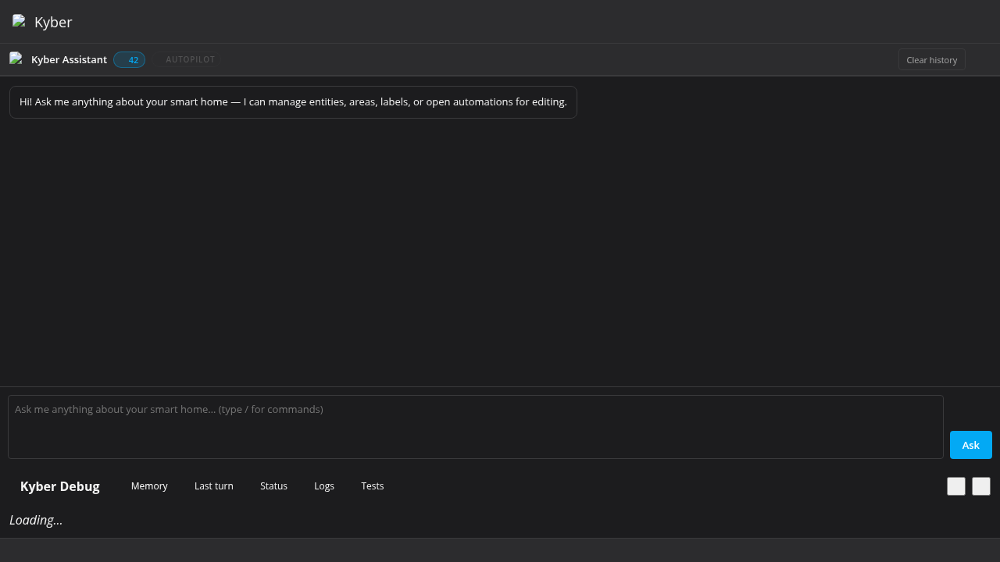

---

## Sending Messages

Type any question or instruction in the prompt box at the bottom and press **Ask** or `Enter`.

```
You: Turn on the living room lights at 80% brightness
```

```
You: Move all the bedroom sensors to the Bedroom area
```

```
You: Rename light.bedroom_ceiling to "Ceiling Light"
```

The AI understands **natural language** and **multiple languages**. If you refer to a room in Dutch ("Slaapkamer") or use a partial name ("the couch lamp"), the AI automatically maps it to the closest matching entity or area and notes the mapping in its reply.

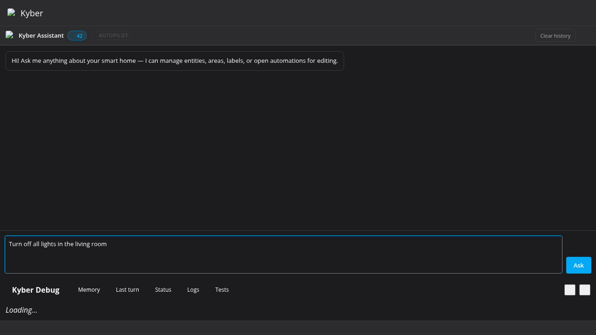

> **Tip:** Press `↑` / `↓` in the prompt box to navigate through your previous messages, just like a shell.

After sending, the AI reply appears as an assistant bubble:

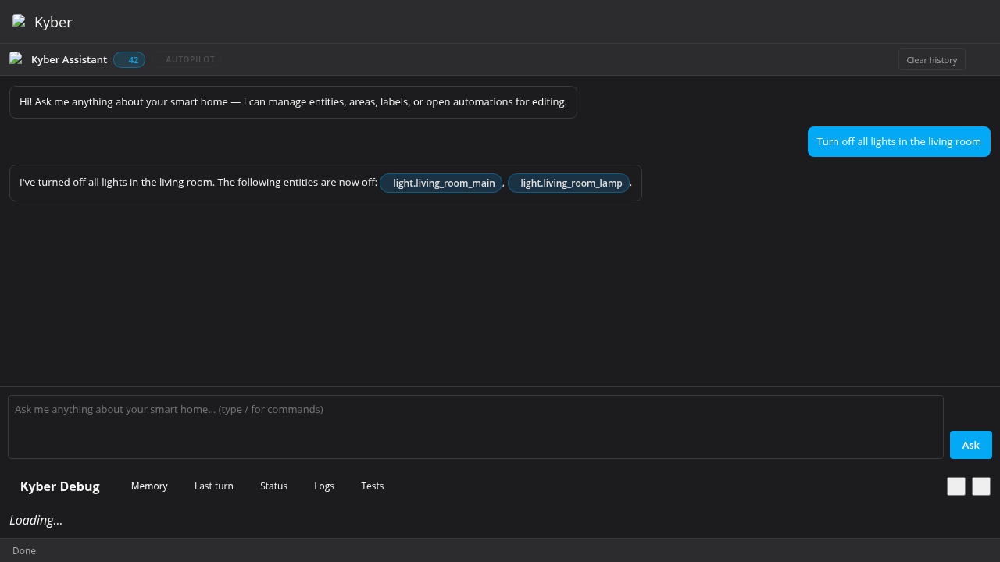

---

## Proposal / Plan Cards

When you ask the AI to change entities, areas, labels, or call services, it responds with a structured **Proposal card** instead of making changes immediately.

### What a Proposal card shows

| Element | Description |
|---|---|
| **📋 Proposal** header | A one-line summary of what the AI intends to do |
| **What will change** list | One row per action: entity ID, change type badge, from → to |
| **Warnings** | Non-fatal side-effect notices (e.g. "area has entities assigned") |
| **Missing entity errors** | Red ⛔ banner if an entity ID wasn't found in HA; those actions are skipped |
| **✅ Execute** button | Applies all valid actions |
| **↩ Undo** button | Appears after execution; reverts every change |

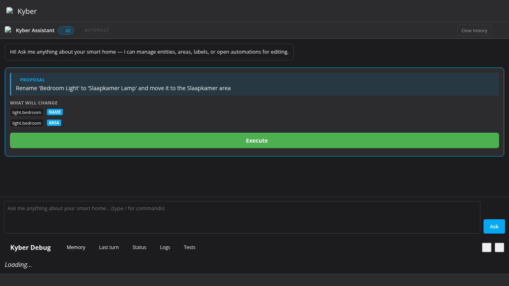

The AI can also propose a plan directly in the chat flow:

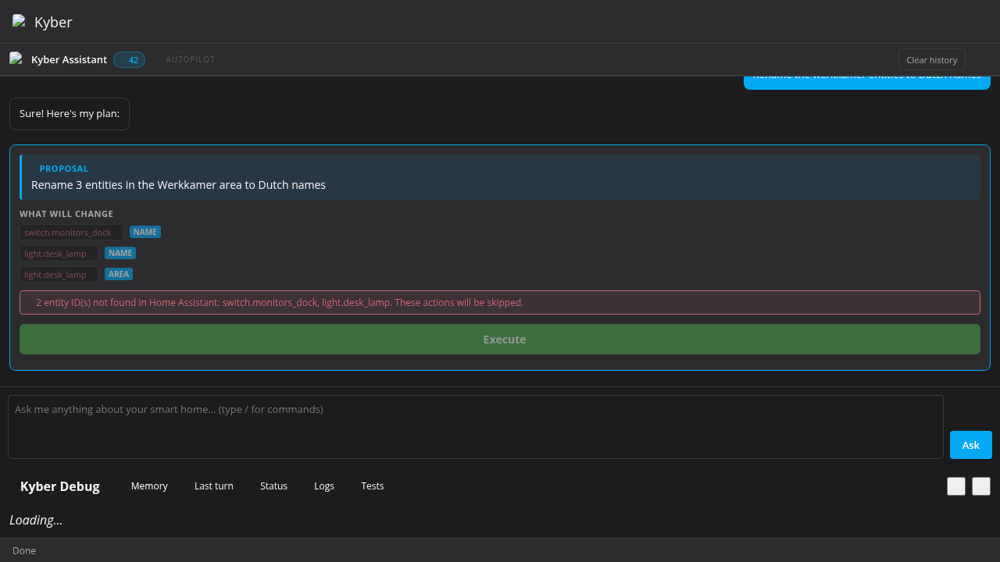

### After execution

On success, a green result row appears and the **↩ Undo** button becomes available:

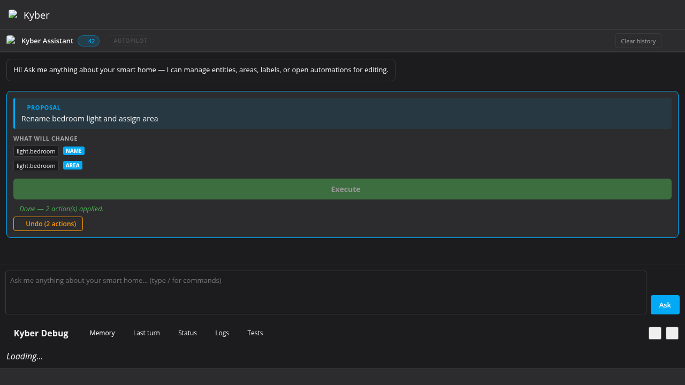

On failure, a red error row shows the reason:

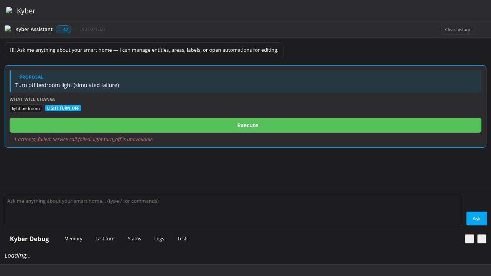

### Missing entity handling

If the AI includes an entity ID that does not exist in your Home Assistant:

- A red ⛔ banner lists the unknown IDs.
- Those rows are dimmed and **skipped** when you click Execute.
- The Execute button label shows the count: `✅ Execute (2 of 3)`.

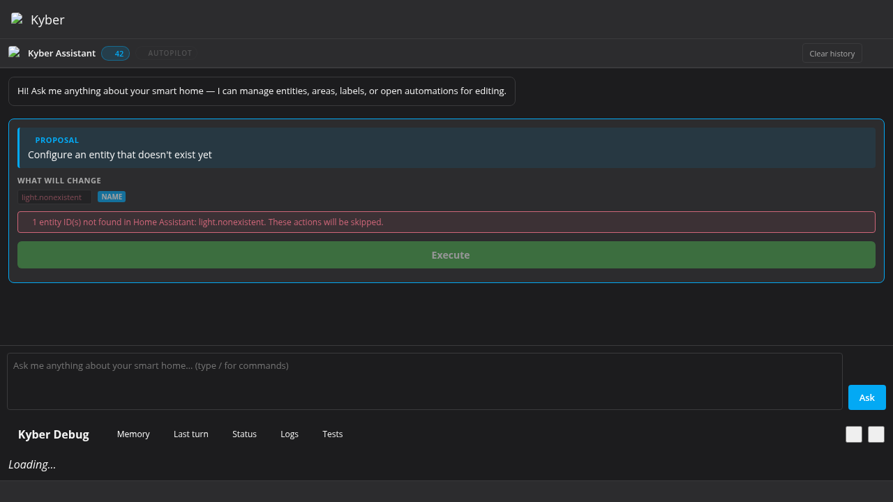

### Example interaction

```
You: Set the thermostat to 21°C and turn off the garden switch
```

The AI returns:

```
I'll update both devices for you.
```

Followed by a Proposal card:

```
📋 Proposal
  Adjust thermostat and garden switch

What will change
  climate.living_room   [climate.set_temperature]   19°C → 21°C
  switch.garden         [switch.turn_off]            on → off

                    ✅ Execute
```

After clicking **Execute**:

```
✅ Done — 2 action(s) applied.
↩ Undo (2 actions)
```

### Supported action types

| Badge | What it does |
|---|---|
| `Area` | Assign an entity to an area |
| `Name` | Rename an entity |
| `Label` | Add a label to an entity |
| `Remove label` | Remove a label from an entity |
| `Create area` | Create a new HA area |
| `Rename area` | Rename an existing area |
| `Delete area` | Delete an area |
| `<domain>.<service>` | Call any HA service (e.g. `light.turn_on`, `climate.set_temperature`) |

---

## Autopilot Mode

Autopilot lets Kyber execute proposals and apply YAML suggestions automatically, without you clicking **Execute** or **Apply** each time.

### Enabling / disabling

Type a slash command in the prompt box:

```
/autopilot on
```

```
/autopilot off
```

An **⚡ AUTOPILOT ON** badge pulses orange in the status bar whenever autopilot is active.

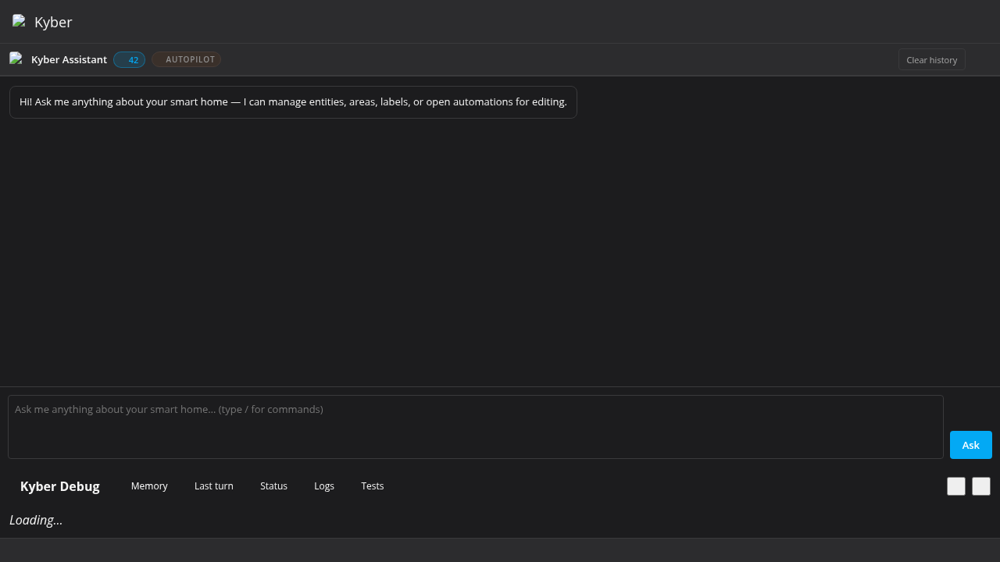

### Behaviour in autopilot mode

| Event | Normal mode | Autopilot mode |
|---|---|---|
| Proposal card rendered | Shows **Execute** button | Auto-executes after **2 seconds** |
| YAML suggestion rendered | Shows **Apply** button | Auto-applies immediately (if editor is open) |
| Dashboard / editor open prompt | Shows **Open editor** button | Clicks button automatically after 300 ms |

> **Caution:** Autopilot makes real changes to your Home Assistant setup without confirmation. Use it only when you trust the AI's proposals for the current task.

---

## Conversation History & Context Compaction

Every message you send and every AI reply is kept in a rolling **chat history** that is forwarded to the AI with each new request. This allows multi-turn conversations where the AI remembers what was said earlier.

Kyber now persists this chat history (including the compacted summary) in Home Assistant storage, scoped to the currently logged-in user. This means chat context survives browser refreshes and Home Assistant restarts.

### Clear history

Use the **Clear history** button in the chat toolbar to reset the current user's conversation state. This clears:

- the visible chat messages in the panel
- in-memory `_chatHistory`
- persisted history and compacted summary in HA storage for that user

### History window

| Parameter | Default |
|---|---|
| Messages kept verbatim | Last **5** |
| Compaction trigger | When history exceeds **7** messages |

### Compaction (summarisation)

When the history grows beyond the trigger threshold, the oldest messages are automatically summarised server-side via the `/api/kyber/summarize` endpoint. The resulting compact summary is prepended to subsequent requests under the label `[Earlier in this conversation]`, keeping the context window efficient without losing important history.

The summariser **always preserves** lines that begin with `[CHANGE]` (see below) so the AI never forgets what has actually been done.

### What the AI sees per request

```
[Earlier in this conversation]
<compacted summary of older messages>

[Recent messages]
User: Turn on the bedroom light
Assistant: Done — bedroom light is now on.
…

User: <your current message>
Assistant:
```

---

## [CHANGE] Tagging

Every time a proposal is successfully executed, or a YAML file is saved, Kyber writes a special tagged entry into the conversation history:

```
[CHANGE] The following changes were successfully applied:
- call_service on light.bedroom: off → on (brightness 200)
- assign_area on sensor.bedroom_temp: Kitchen → Bedroom
```

```
[CHANGE] automation YAML saved: morning_lights
```

```
[CHANGE] Dashboard "My Dashboard" saved successfully.
```

These `[CHANGE]` lines are **never dropped** during compaction. They give the AI a reliable, persistent record of every change made in the current session, so follow-up questions like *"what did you just change?"* or *"undo the last thing"* always have accurate context.

---

## Entity Autocomplete

The prompt box includes a live autocomplete dropdown that helps you reference exact entity IDs without having to remember them.

### Triggering autocomplete

| Trigger | What it matches |
|---|---|
| Type any partial text (≥ 2 chars) | All `entity_id` values that **start with** your text |
| Type `/` | Available slash commands |
| Type `/automation open <partial>` | Automation names / entity IDs |
| Type `/script open <partial>` | Script names / entity IDs |
| Type `/dashboard open <partial>` | Dashboard url_paths / titles |

### Navigating the dropdown

| Key | Action |
|---|---|
| `↓` / `↑` | Move selection |
| `Enter` or `Tab` | Insert highlighted item |
| `Escape` | Close without inserting |

The dropdown shows both the `entity_id` (monospace) and the friendly name beneath it.

### Example

```
You type: light.bed[↓ dropdown opens]
   light.bedroom
   light.bedroom_ceiling   "Ceiling Light"
   light.bedroom_lamp      "Bedside Lamp"
```

Press `Enter` or `Tab` to insert the full entity ID at the cursor.

---

## Context Awareness

Every AI request is sent with a compact context block built from your live Home Assistant state. The AI therefore knows:

| Context | Detail |
|---|---|
| **Home summary** | Counts for areas, labels, automations, scripts, and entity domains |
| **Areas** | Name and `area_id` for every area |
| **Current home state** | Only notable per-area state (lights on, occupancy, temperature, media, alerts) |
| **Dashboards** | Title, `url_path`, and mode for every Lovelace panel |
| **Custom card resources** | JS resource URLs loaded via HACS or manually |
| **Current user** | Your display name and admin/standard role |
| **Open editor content** | Full YAML of the automation or dashboard currently in the editor |

This means you can ask things like:

```
You: Which lights are in the Kitchen area?
You: Add a tile card for every sensor in the Bedroom to my Test dashboard
You: What automations do I have that use the motion sensor?
```

Kyber also injects a short "query type → first tool" router near the top of the prompt so current-state questions prefer `get_entity_state`, room questions prefer `get_area_entities`, and room-management tools such as `get_areas` are only used for area-specific requests.

…and the AI can answer accurately without you copy-pasting entity IDs.

### Custom card awareness

If you have custom Lovelace cards installed (e.g. via HACS), their JS resource URLs are fetched once per session and included in context. The AI will use `type: custom:<card-name>` syntax automatically when those cards are available.

---

## Knowledge / Memory

Kyber maintains a **knowledge store** — a set of learned facts about your home that are recalled during AI requests. When a fact is used, the memory badge pulses to indicate knowledge was applied.

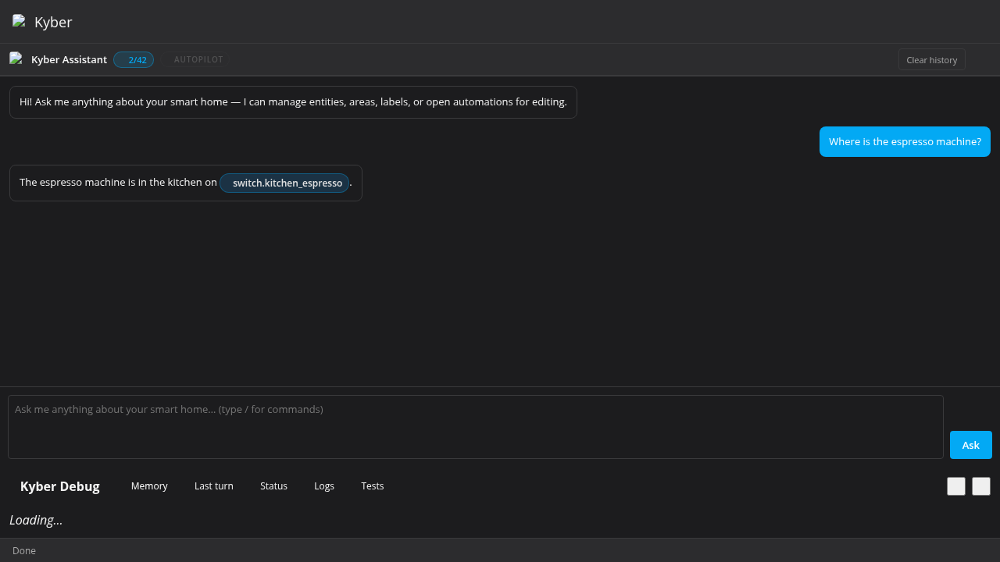

Click the memory badge to open the popover and see which facts were recalled in the last turn:

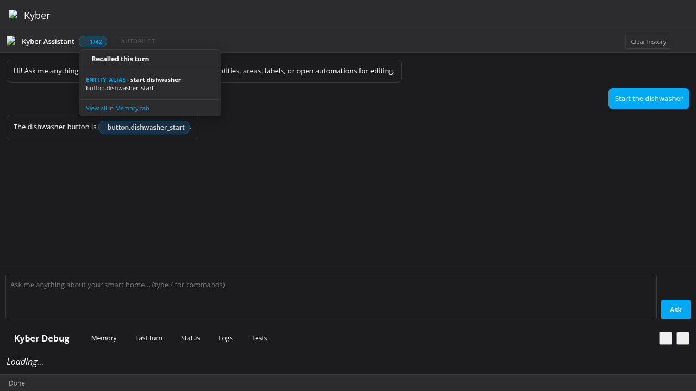

Use `/memory analyze` or `/memory deep` to build up the knowledge store from your existing automations, dashboards, and entity registry.

---

## Multi-language Support

Kyber works in English, Dutch, German, French, Spanish, and Italian — no configuration needed.

Write your message in whatever language feels natural. The AI always replies in the same language you used.

```
You: Zet de woonkamer lampen aan op 60%
You: Schalte das Licht im Schlafzimmer aus
You: Allume les lumières du salon
```

### How it works

Kyber's knowledge store is indexed in English (entity notes, memory facts, area mappings). When you write in a non-English language, your query is silently translated to English before the knowledge lookup so the right facts surface — then the AI replies in your language.

This is fully automatic. The system detects whether non-English messages have been sent recently (last 10 prompts) and enables translation only when needed. Once all recent messages are English again, it switches back. You will never see any indication of this happening.

### Supported languages

| Language | Rooms | Devices | Actions | Appliances |
|---|---|---|---|---|
| Dutch (nl) | ✓ | ✓ | ✓ | ✓ |
| German (de) | ✓ | ✓ | ✓ | ✓ |
| French (fr) | ✓ | ✓ | ✓ | ✓ |
| Spanish (es) | ✓ | ✓ | ✓ | ✓ |
| Italian (it) | ✓ | ✓ | ✓ | ✓ |

Entity IDs and proper names are always passed through unchanged — they are language-neutral by design.

---

## Slash Commands

Slash commands are typed directly in the prompt box and execute without going to the AI.

### Autopilot

```
/autopilot on        — enable autopilot mode
/autopilot off       — disable autopilot mode
```

### Automation

```
/automation open <name>     — open automation YAML editor (partial name OK)
/automation close           — close the editor
/automation save            — save the current automation
/automation new             — open HA automation editor in a new tab
/automation delete <name>   — permanently delete an automation
```

### Script

```
/script open <name>         — open script YAML editor
/script close               — close the editor
/script save                — save the current script
/script new                 — open HA script editor in a new tab
/script delete <name>       — permanently delete a script
```

### Dashboard

```
/dashboard open [name]      — open dashboard YAML editor
/dashboard close            — close the editor
/dashboard save             — save the current dashboard
/dashboard new              — create a new dashboard (prompts for title)
/dashboard delete           — delete the currently open dashboard
```

### Area

```
/area new <name>                    — create a new area
/area delete <name>                 — delete an area
/area rename <old> to <new>         — rename an area
/area list                          — list all areas
```

### Blueprint

```
/blueprint browse           — open HA blueprint page in a new tab
```

### Session

```
/session list              — list chat sessions
/session new [name]        — create and switch to a new session
/session switch <name>     — switch active session
/session delete            — delete current session (with confirmation)
```

### Knowledge / Memory

```
/memory                    — list memory entries  (/knowledge is an alias)
/memory search <q>         — search entries by keyword, category, or tag
/memory add <text>         — add a new fact directly
/memory analyze            — propose facts from your current setup
/memory deep               — start deep background analysis (6-lens rotation)
/memory stats              — show entry counts by category and source
/memory delete <id>        — delete a memory entry (autocomplete on IDs)
```

### Update

```
/update                    — check for updates via HACS and install
/update restart            — install via HACS + restart HA
/update force              — bypass HACS, download direct from GitHub
/update force restart      — download direct from GitHub + restart HA
```

### Utility

```
/help [topic]              — show command help
/reset                     — clear current session history (with confirmation)
```

All slash commands that make changes show a **confirmation card** with an Execute and Cancel button before taking effect. Destructive operations (delete) display an additional danger warning.


---

## Area Suggestion Cards

Kyber watches for entities that have no area assigned. When it detects one, it proactively shows a suggestion card in the chat:

```
🏠 onoff_keuken_espresso_307 has no area — assign to Keuken?

[ ✓ Assign ]   [ ✕ Dismiss ]
```

Clicking **Assign** calls the execute endpoint to set the area. Clicking **Dismiss** records the dismissal so the same suggestion isn't shown again.

### Location intent detection

If you type a statement like:

```
De espresso machine staat in de keuken
The coffee maker is in the kitchen
```

Kyber classifies this as an **action intent** (not a question) and triggers the area assignment flow automatically — no need to use a slash command.

**Supported location phrases:**
- Dutch: *staat in, zit in, hangt in, ligt in, hoort in, staan in*
- English: *is in the, belongs in, located in, placed in*

---

## Sample Conversations

### Controlling devices

```
You: Turn on all the lights in the living room at 50%

AI: I'll turn on the living room lights at 50% brightness.

📋 Proposal
  Turn on all living room lights at 50% brightness

What will change
  light.living_room_main   [light.turn_on]   off → on (brightness 127)
  light.living_room_lamp   [light.turn_on]   off → on (brightness 127)

✅ Execute
```

### Reorganising areas

```
You: All my bedroom devices are in the wrong area — move sensor.bedroom_temp,
     switch.bedroom_fan, and light.bedroom to "Bedroom"

AI: I'll move all three to the Bedroom area.

📋 Proposal
  Assign three bedroom devices to Bedroom

What will change
  sensor.bedroom_temp   [Area]   Kitchen → Bedroom
  switch.bedroom_fan    [Area]   (none)  → Bedroom
  light.bedroom         [Area]   Hallway → Bedroom

✅ Execute
```

### Multi-turn editing

```
You: Open the morning lights automation

AI: [opens editor with YAML]
    Here's the Morning Lights automation. What would you like to change?

You: Make it trigger at 7:30 instead of 7:00

AI: [returns updated YAML block with Apply button]
    I've updated the trigger time from 07:00 to 07:30.

You: Also add a condition so it only runs on weekdays

AI: [returns another updated YAML block]
    Done — I've added a weekday condition.
```

Type any question or instruction in the prompt box at the bottom and press **Ask** or `Enter`.

```
You: Turn on the living room lights at 80% brightness
```

```
You: Move all the bedroom sensors to the Bedroom area
```

```
You: Rename light.bedroom_ceiling to "Ceiling Light"
```

The AI understands **natural language** and **multiple languages**. If you refer to a room in Dutch ("Slaapkamer") or use a partial name ("the couch lamp"), the AI automatically maps it to the closest matching entity or area and notes the mapping in its reply.

> **Tip:** Press `↑` / `↓` in the prompt box to navigate through your previous messages, just like a shell.

---

## Proposal / Plan Cards

When you ask the AI to change entities, areas, labels, or call services, it responds with a structured **Proposal card** instead of making changes immediately.

### What a Proposal card shows

| Element | Description |
|---|---|
| **📋 Proposal** header | A one-line summary of what the AI intends to do |
| **What will change** list | One row per action: entity ID, change type badge, from → to |
| **Warnings** | Non-fatal side-effect notices (e.g. "area has entities assigned") |
| **Missing entity errors** | Red ⛔ banner if an entity ID wasn't found in HA; those actions are skipped |
| **✅ Execute** button | Applies all valid actions |
| **↩ Undo** button | Appears after execution; reverts every change |

### Example interaction

```
You: Set the thermostat to 21°C and turn off the garden switch
```

The AI returns:

```
I'll update both devices for you.
```

Followed by a Proposal card:

```
📋 Proposal
  Adjust thermostat and garden switch

What will change
  climate.living_room   [climate.set_temperature]   19°C → 21°C
  switch.garden         [switch.turn_off]            on → off

                    ✅ Execute
```

After clicking **Execute**:

```
✅ Done — 2 action(s) applied.
↩ Undo (2 actions)
```

### Supported action types

| Badge | What it does |
|---|---|
| `Area` | Assign an entity to an area |
| `Name` | Rename an entity |
| `Label` | Add a label to an entity |
| `Remove label` | Remove a label from an entity |
| `Create area` | Create a new HA area |
| `Rename area` | Rename an existing area |
| `Delete area` | Delete an area |
| `<domain>.<service>` | Call any HA service (e.g. `light.turn_on`, `climate.set_temperature`) |

### Missing entity handling

If the AI includes an entity ID that does not exist in your Home Assistant:

- A red ⛔ banner lists the unknown IDs.
- Those rows are dimmed and **skipped** when you click Execute.
- The Execute button label shows the count: `✅ Execute (2 of 3)`.

---

## Autopilot Mode

Autopilot lets Kyber execute proposals and apply YAML suggestions automatically, without you clicking **Execute** or **Apply** each time.

### Enabling / disabling

Type a slash command in the prompt box:

```
/autopilot on
```

```
/autopilot off
```

An **⚡ AUTOPILOT ON** badge pulses orange in the status bar whenever autopilot is active.

### Behaviour in autopilot mode

| Event | Normal mode | Autopilot mode |
|---|---|---|
| Proposal card rendered | Shows **Execute** button | Auto-executes after **2 seconds** |
| YAML suggestion rendered | Shows **Apply** button | Auto-applies immediately (if editor is open) |
| Dashboard / editor open prompt | Shows **Open editor** button | Clicks button automatically after 300 ms |

> **Caution:** Autopilot makes real changes to your Home Assistant setup without confirmation. Use it only when you trust the AI's proposals for the current task.

---

## Conversation History & Context Compaction

Every message you send and every AI reply is kept in a rolling **chat history** that is forwarded to the AI with each new request. This allows multi-turn conversations where the AI remembers what was said earlier.

Kyber now persists this chat history (including the compacted summary) in Home Assistant storage, scoped to the currently logged-in user. This means chat context survives browser refreshes and Home Assistant restarts.

### Clear history

Use the **Clear history** button in the chat toolbar to reset the current user's conversation state. This clears:

- the visible chat messages in the panel
- in-memory `_chatHistory`
- persisted history and compacted summary in HA storage for that user

### History window

| Parameter | Default |
|---|---|
| Messages kept verbatim | Last **5** |
| Compaction trigger | When history exceeds **7** messages |

### Compaction (summarisation)

When the history grows beyond the trigger threshold, the oldest messages are automatically summarised server-side via the `/api/kyber/summarize` endpoint. The resulting compact summary is prepended to subsequent requests under the label `[Earlier in this conversation]`, keeping the context window efficient without losing important history.

The summariser **always preserves** lines that begin with `[CHANGE]` (see below) so the AI never forgets what has actually been done.

### What the AI sees per request

```
[Earlier in this conversation]
<compacted summary of older messages>

[Recent messages]
User: Turn on the bedroom light
Assistant: Done — bedroom light is now on.
…

User: <your current message>
Assistant:
```

---

## [CHANGE] Tagging

Every time a proposal is successfully executed, or a YAML file is saved, Kyber writes a special tagged entry into the conversation history:

```
[CHANGE] The following changes were successfully applied:
- call_service on light.bedroom: off → on (brightness 200)
- assign_area on sensor.bedroom_temp: Kitchen → Bedroom
```

```
[CHANGE] automation YAML saved: morning_lights
```

```
[CHANGE] Dashboard "My Dashboard" saved successfully.
```

These `[CHANGE]` lines are **never dropped** during compaction. They give the AI a reliable, persistent record of every change made in the current session, so follow-up questions like *"what did you just change?"* or *"undo the last thing"* always have accurate context.

---

## Entity Autocomplete

The prompt box includes a live autocomplete dropdown that helps you reference exact entity IDs without having to remember them.

### Triggering autocomplete

| Trigger | What it matches |
|---|---|
| Type any partial text (≥ 2 chars) | All `entity_id` values that **start with** your text |
| Type `/` | Available slash commands |
| Type `/automation open <partial>` | Automation names / entity IDs |
| Type `/script open <partial>` | Script names / entity IDs |
| Type `/dashboard open <partial>` | Dashboard url_paths / titles |

### Navigating the dropdown

| Key | Action |
|---|---|
| `↓` / `↑` | Move selection |
| `Enter` or `Tab` | Insert highlighted item |
| `Escape` | Close without inserting |

The dropdown shows both the `entity_id` (monospace) and the friendly name beneath it.

### Example

```
You type: light.bed[↓ dropdown opens]
   light.bedroom
   light.bedroom_ceiling   "Ceiling Light"
   light.bedroom_lamp      "Bedside Lamp"
```

Press `Enter` or `Tab` to insert the full entity ID at the cursor.

---

## Context Awareness

Every AI request is sent with a compact context block built from your live Home Assistant state. The AI therefore knows:

| Context | Detail |
|---|---|
| **Home summary** | Counts for areas, labels, automations, scripts, and entity domains |
| **Areas** | Name and `area_id` for every area |
| **Current home state** | Only notable per-area state (lights on, occupancy, temperature, media, alerts) |
| **Dashboards** | Title, `url_path`, and mode for every Lovelace panel |
| **Custom card resources** | JS resource URLs loaded via HACS or manually |
| **Current user** | Your display name and admin/standard role |
| **Open editor content** | Full YAML of the automation or dashboard currently in the editor |

This means you can ask things like:

```
You: Which lights are in the Kitchen area?
You: Add a tile card for every sensor in the Bedroom to my Test dashboard
You: What automations do I have that use the motion sensor?
```

Kyber also injects a short “query type → first tool” router near the top of the prompt so current-state questions prefer `get_entity_state`, room questions prefer `get_area_entities`, and room-management tools such as `get_areas` are only used for area-specific requests.

…and the AI can answer accurately without you copy-pasting entity IDs.

### Custom card awareness

If you have custom Lovelace cards installed (e.g. via HACS), their JS resource URLs are fetched once per session and included in context. The AI will use `type: custom:<card-name>` syntax automatically when those cards are available.

---

## Multi-language Support

Kyber works in English, Dutch, German, French, Spanish, and Italian — no configuration needed.

Write your message in whatever language feels natural. The AI always replies in the same language you used.

```
You: Zet de woonkamer lampen aan op 60%
You: Schalte das Licht im Schlafzimmer aus
You: Allume les lumières du salon
```

### How it works

Kyber's knowledge store is indexed in English (entity notes, memory facts, area mappings). When you write in a non-English language, your query is silently translated to English before the knowledge lookup so the right facts surface — then the AI replies in your language.

This is fully automatic. The system detects whether non-English messages have been sent recently (last 10 prompts) and enables translation only when needed. Once all recent messages are English again, it switches back. You will never see any indication of this happening.

### Supported languages

| Language | Rooms | Devices | Actions | Appliances |
|---|---|---|---|---|
| Dutch (nl) | ✓ | ✓ | ✓ | ✓ |
| German (de) | ✓ | ✓ | ✓ | ✓ |
| French (fr) | ✓ | ✓ | ✓ | ✓ |
| Spanish (es) | ✓ | ✓ | ✓ | ✓ |
| Italian (it) | ✓ | ✓ | ✓ | ✓ |

Entity IDs and proper names are always passed through unchanged — they are language-neutral by design.

---

## Slash Commands

Slash commands are typed directly in the prompt box and execute without going to the AI.

### Autopilot

```
/autopilot on        — enable autopilot mode
/autopilot off       — disable autopilot mode
```

### Automation

```
/automation open <name>     — open automation YAML editor (partial name OK)
/automation close           — close the editor
/automation save            — save the current automation
/automation new             — open HA automation editor in a new tab
/automation delete <name>   — permanently delete an automation
```

### Script

```
/script open <name>         — open script YAML editor
/script close               — close the editor
/script save                — save the current script
/script new                 — open HA script editor in a new tab
/script delete <name>       — permanently delete a script
```

### Dashboard

```
/dashboard open [name]      — open dashboard YAML editor
/dashboard close            — close the editor
/dashboard save             — save the current dashboard
/dashboard new              — create a new dashboard (prompts for title)
/dashboard delete           — delete the currently open dashboard
```

### Area

```
/area new <name>                    — create a new area
/area delete <name>                 — delete an area
/area rename <old> to <new>         — rename an area
/area list                          — list all areas
```

### Blueprint

```
/blueprint browse           — open HA blueprint page in a new tab
```

### Session

```
/session list              — list chat sessions
/session new [name]        — create and switch to a new session
/session switch <name>     — switch active session
/session delete            — delete current session (with confirmation)
```

### Knowledge / Memory

```
/memory                    — list memory entries  (/knowledge is an alias)
/memory search <q>         — search entries by keyword, category, or tag
/memory add <text>         — add a new fact directly
/memory analyze            — propose facts from your current setup
/memory deep               — start deep background analysis (6-lens rotation)
/memory stats              — show entry counts by category and source
/memory delete <id>        — delete a memory entry (autocomplete on IDs)
```

### Update

```
/update                    — check for updates via HACS and install
/update restart            — install via HACS + restart HA
/update force              — bypass HACS, download direct from GitHub
/update force restart      — download direct from GitHub + restart HA
```

### Utility

```
/help [topic]              — show command help
/reset                     — clear current session history (with confirmation)
```

All slash commands that make changes show a **confirmation card** with an Execute and Cancel button before taking effect. Destructive operations (delete) display an additional danger warning.

---

## Area Suggestion Cards

Kyber watches for entities that have no area assigned. When it detects one, it proactively shows a suggestion card in the chat:

```
🏠 onoff_keuken_espresso_307 has no area — assign to Keuken?

[ ✓ Assign ]   [ ✕ Dismiss ]
```

Clicking **Assign** calls the execute endpoint to set the area. Clicking **Dismiss** records the dismissal so the same suggestion isn't shown again.

### Location intent detection

If you type a statement like:

```
De espresso machine staat in de keuken
The coffee maker is in the kitchen
```

Kyber classifies this as an **action intent** (not a question) and triggers the area assignment flow automatically — no need to use a slash command.

**Supported location phrases:**
- Dutch: *staat in, zit in, hangt in, ligt in, hoort in, staan in*
- English: *is in the, belongs in, located in, placed in*

---

## Sample Conversations

### Controlling devices

```
You: Turn on all the lights in the living room at 50%

AI: I'll turn on the living room lights at 50% brightness.

📋 Proposal
  Turn on all living room lights at 50% brightness

What will change
  light.living_room_main   [light.turn_on]   off → on (brightness 127)
  light.living_room_lamp   [light.turn_on]   off → on (brightness 127)

✅ Execute
```

### Reorganising areas

```
You: All my bedroom devices are in the wrong area — move sensor.bedroom_temp,
     switch.bedroom_fan, and light.bedroom to "Bedroom"

AI: I'll move all three to the Bedroom area.

📋 Proposal
  Assign three bedroom devices to Bedroom

What will change
  sensor.bedroom_temp   [Area]   Kitchen → Bedroom
  switch.bedroom_fan    [Area]   (none)  → Bedroom
  light.bedroom         [Area]   Hallway → Bedroom

✅ Execute
```

### Multi-turn editing

```
You: Open the morning lights automation

AI: [opens editor with YAML]
    Here's the Morning Lights automation. What would you like to change?

You: Make it trigger at 7:30 instead of 7:00

AI: [returns updated YAML block with Apply button]
    I've updated the trigger time from 07:00 to 07:30.

You: Also add a condition so it only runs on weekdays

AI: [returns another updated YAML block]
    Done — I've added a weekday condition.
```
