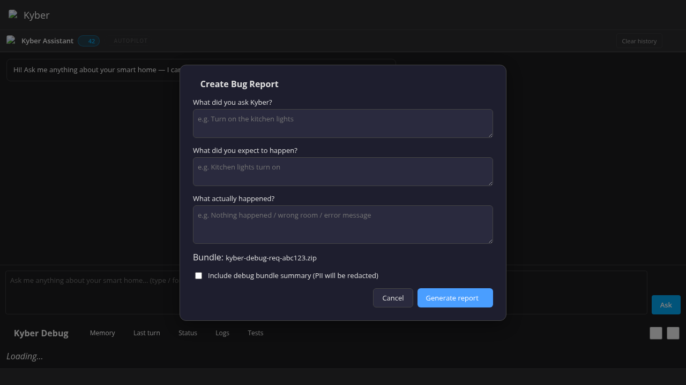

# Kyber — Debug Panel

The Kyber Debug Panel provides visibility into AI reasoning, memory state, entity narrator progress, and log output. It is intended for developers and advanced users who want to understand what Kyber is doing under the hood.

---

## Accessing the Debug Panel

The debug panel is a separate HA sidebar entry registered as `/kyber-debug`. After installation it appears in the HA left sidebar alongside the main Kyber chat panel.

---

## Tabs

### Memory

Browse, rate, and refine knowledge entries stored by Kyber.

- Shows all facts in the knowledge store (type, content, source, quality score)
- Rate a fact with 👍 / 👎 — this updates the quality score in the store
- Edit or refine the content of a fact inline
- Filter by type: `entity_alias`, `home_preference`, `user_preference`, `entity_fact`, `home_fact`
- Facts with a score below `MIN_QUALITY_SCORE` are shown dimmed and can be bulk-purged

**Export:** Click **Export Memory** to download all facts as `kyber-memory-<timestamp>.json`.

---

### Last Turn

A detailed breakdown of the most recent AI turn.

- **System prompt** — the full prompt sent to the AI (context + memory + chat history)
- **Tool calls** — ordered list of tools invoked by the AI with their arguments and results
- **Response** — raw AI text output
- **Tokens** — estimated input/output token counts if available
- **Debug bundle** — download a ZIP containing the full turn snapshot for bug reports

---

### Status

An overview of the current integration state.

- **Memory stats** — total facts, quality distribution, last analyze/deep run timestamp
- **Session info** — active session ID, number of turns, last compaction timestamp
- **Narrator progress** — entities narrated vs total, current narrator version, any errors
- **Entity explorer** — browse all entities with their stored aliases and descriptions; useful for verifying narrator output

---

### Logs

A live ring-buffer of Kyber log records.

- Shows the last 500 log entries (configurable in `debug_and_diagnostics.py`)
- Filter by level: DEBUG / INFO / WARNING / ERROR
- Entries are colour-coded by level
- Automatically scrolls to the bottom when new entries arrive
- **Copy to clipboard** button exports the visible log as plain text

Log data is fetched from `/api/kyber/debug/logs`.

---

### Tests

The prompt regression test runner (developer feature).

- **Capture** — save the AI's current response to the last prompt as a test baseline
- **Run all** — replay all captured tests and compare responses to baselines
- **Pass/Fail** — tests are marked pass if the response contains all expected phrases, fail otherwise
- **Regenerate** — update a test's expected output to the current AI response

Test cases are managed via `/api/kyber/prompt_tests`. They are stored in `.storage/kyber.prompt_tests`.

---

### MCP

The MCP tab provides monitoring and comparison tools for the MCP server.

**Path:** Kyber Debug sidebar (`/kyber-debug`) → **🔌 MCP** tab

#### Side-by-side Compare

Run the same prompt through the MCP pipeline (`kyber_ask`) and the classic chat pipeline simultaneously and compare the responses side by side. Useful for verifying that MCP and chat produce consistent results.

```
[Prompt ___________________________________] [▶ Run Compare]

MCP Result                    │  Classic Result
─────────────────────────────────────────────────────────
"The living room light is…"   │  "The living room light is…"

Timing: MCP 1204ms  •  Classic 892ms
```

#### Call Log

A unified ring-buffer log of the last **200 calls** per source (MCP and Classic), stored in memory (cleared on HA restart).

| Column | Description |
|---|---|
| Time | Timestamp of the call |
| Source | 🔌 MCP or 🏠 Classic (chat panel) |
| Method | Tool name or `chat` |
| User | HA user ID |
| ms | Elapsed time |
| Outcome | ✅ ok / ❌ error |

Use `GET /api/kyber/mcp/log` to retrieve the log programmatically. Use `DELETE /api/kyber/mcp/log` to clear it.

---

## Bug Report Export

From the Last Turn tab, click **Download Debug Bundle** to get a sanitised ZIP containing:

- Last turn system prompt (with home addresses and user names redacted)
- Tool call log
- AI response
- Memory stats snapshot
- HA version info

This file can be attached to GitHub issues to help diagnose problems.

The same bundle is available at `/api/kyber/debug/bug-report` (GET).


