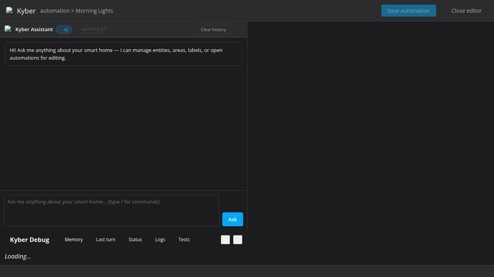
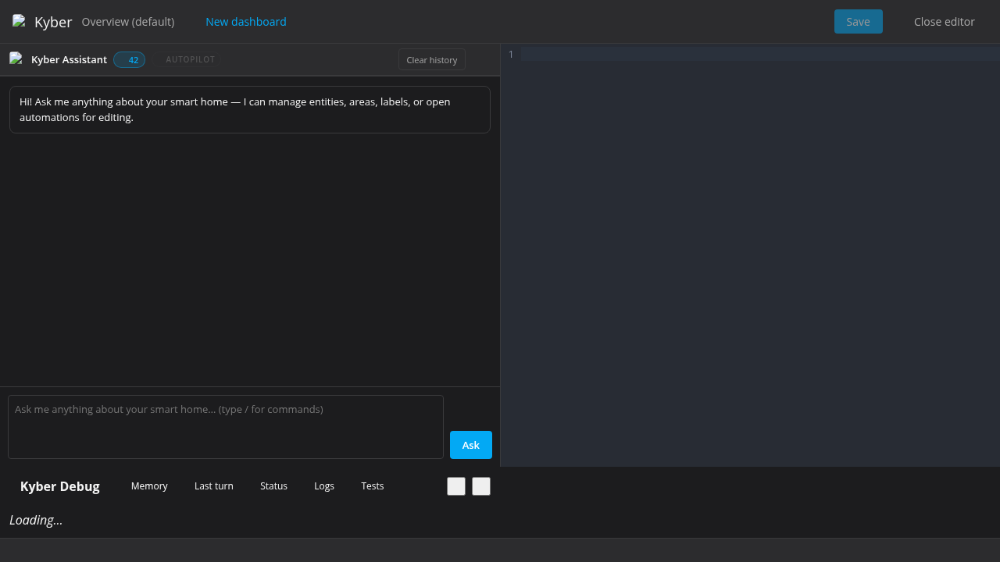

# Kyber YAML Editor

Kyber embeds a full-featured YAML editor directly in the Home Assistant sidebar panel. It supports editing **automations**, **scripts**, and **Lovelace dashboards** — all without leaving the chat interface.

---

### Editor context breadcrumb

When the editor is open, the toolbar shows the current automation/dashboard name next to **⚡ Kyber** as a secondary label:

```
⚡ Kyber  Morning Lights
⚡ Kyber  Overview (default)
```

This gives a quick visual confirmation of which file is being edited. The label updates automatically when you switch dashboards via the dropdown.





---

## Automation / Script Editor

### Opening the editor

The automation/script editor can be opened in three ways:

1. **AI proposal** — when you ask the AI to edit an automation or script, it returns a `plan` block. Click **Open YAML editor** to load the file:

   ```plan
   {
     "open_editor": true,
     "automation_id": "automation.morning_lights",
     "summary": "Add a sunrise trigger to the morning lights automation"
   }
   ```

2. **Slash command** — type directly in the chat input:

   ```
   /automation open morning lights
   /script open bedtime scene
   ```

   Kyber performs a fuzzy match on the name and shows a confirmation card before opening.

3. **`/automation new`** — opens Home Assistant's native automation editor in a new browser tab.

### CodeMirror 6 editor features

The embedded editor is powered by [CodeMirror 6](https://codemirror.net/) and includes:

| Feature | Details |
|---|---|
| YAML syntax highlighting | Full tokenisation of keys, values, strings, and anchors |
| Line numbers | Displayed in the left gutter |
| Bracket matching | Highlights matching `{`, `[`, and `"` pairs |
| Fold gutters | Collapse/expand nested YAML blocks |
| Autocomplete | Context-aware suggestions |
| One-dark theme | Easy-on-the-eyes dark colour scheme |
| Keyboard shortcut isolation | HA's global shortcuts are suppressed while typing |

### Saving

1. Edit the YAML in the editor.
2. Click the **Save** button (enabled as soon as you make a change).
3. Kyber POSTs the raw YAML to `/api/kyber/parse_yaml` for server-side parsing into JSON.
4. The resulting JSON config is written back to HA via the config REST API:

   | Kind | API path |
   |---|---|
   | Automation | `config/automation/config/<id>` |
   | Script | `config/script/config/<id>` |

5. On success the status bar shows **Saved ✓** and the change is recorded in the AI chat history so the AI stays aware of what was saved.

### AI context awareness

While the editor is open, the current automation/script YAML is included in every AI request. The AI's suggestions apply directly to the open file — you can ask it to add a trigger, change a condition, or restructure actions and it will return an updated YAML block that can be applied to the editor.

---

## Dashboard Editor

### Opening the editor

The dashboard editor can be opened in two ways:

1. **AI proposal** — when you ask the AI to edit a dashboard, it returns a `plan` block. Click **Open Dashboard Editor** to load the file:

   ```plan
   {
     "open_dashboard": true,
     "url_path": "living-room",
     "summary": "Add a weather card to the living-room dashboard"
   }
   ```

   Use `"url_path": null` (or omit it) for the default **Overview** dashboard.

2. **Slash command**:

   ```
   /dashboard open living-room
   /dashboard open             ← opens Overview (default)
   ```

### Dashboard selector

Once the editor is open a **dropdown selector** appears above the editor. It lists every Lovelace dashboard registered in `hass.panels`. Switching the selection immediately loads that dashboard's YAML without closing the editor.

### Creating a new dashboard

Click the **＋ New dashboard** button (or run `/dashboard new`). You will be prompted for a title. Kyber:

1. Derives a URL slug from the title (e.g. `"My Dashboard"` → `my-dashboard`).
2. Creates the dashboard via the WebSocket API (`lovelace/dashboards/create`) with `mode: storage` and `show_in_sidebar: true`.
3. Adds it to the selector and loads a starter config:

   ```yaml
   title: My Dashboard
   views:
     - title: Home
       cards: []
   ```

### Loading

Dashboard YAML is fetched with:

```
GET /api/lovelace/config?url_path=<url_path>
```

For the default Overview the `url_path` parameter is omitted:

```
GET /api/lovelace/config
```

If no stored config exists for a path (404), the editor pre-populates a blank starter template so you can build from scratch.

### Saving

1. Edit the YAML in the editor.
2. Click **Save dashboard**.
3. The YAML is parsed server-side via `/api/kyber/parse_yaml`.
4. The JSON config is written back via:

   ```
   POST /api/lovelace/config?url_path=<url_path>
   ```

5. The status bar shows: **`<Dashboard name>` saved ✓ — reload the browser tab to see changes**.

> **Note:** Home Assistant caches the Lovelace config in the browser. A hard reload (`Ctrl+Shift+R` / `Cmd+Shift+R`) is required to see changes take effect in the HA UI.

### Additional slash commands

| Command | Action |
|---|---|
| `/dashboard close` | Close the dashboard editor |
| `/dashboard save` | Save the currently open dashboard |
| `/dashboard delete` | Delete the currently open dashboard (shows a danger confirmation card) |

---

## Blueprint Editor

Blueprints are YAML files stored in `/config/blueprints/automation/<path>`. The blueprint editor
lets you view and edit these files directly inside Kyber — no SSH or file manager needed.

### Opening the editor

**From an automation that uses a blueprint:**

When you open an automation that references a blueprint (i.e. it has a `use_blueprint:` key), a
**🗺 Edit blueprint** button appears in the toolbar. Clicking it opens the blueprint YAML file
directly in the editor, so you can refine the template without leaving the chat.

**Via slash command:**

```
/blueprint open custom/my_blueprint.yaml
```

The path is relative to `/config/blueprints/automation/`.

**Browsing:**

```
/blueprint browse    ← opens HA's Blueprint page in a new tab
```

### Saving

1. Edit the YAML.
2. Click **Save blueprint**.
3. Kyber POSTs the file to `/api/kyber/blueprint` which writes it to disk.
4. The status bar confirms: **Blueprint saved: custom/my_blueprint.yaml**.

> **Note:** Saving a blueprint does **not** automatically reload existing automations that use it.
> Reload those automations manually in HA's Automations UI, or restart HA to pick up changes.

### Session persistence

Like the automation editor, if you navigate away and return, Kyber reopens the same blueprint file
automatically.

---

## Editor feature parity

All three editors (automation/script, blueprint, dashboard) share the same CodeMirror engine and
must provide the same core features. The table below is the **canonical checklist** — any new
feature added to one editor must be added to all applicable editors:

| Feature | Automation / Script | Blueprint | Dashboard |
|---|:---:|:---:|:---:|
| CodeMirror 6 (syntax highlight, fold, autocomplete) | ✅ | ✅ | ✅ |
| Context breadcrumb label | ✅ | ✅ | ✅ |
| Save button (correct label per mode) | ✅ | ✅ | ✅ |
| Session persistence (reopen after navigation) | ✅ | ✅ | ✅ |
| Unsaved draft restore | ✅ | — | — |
| Floating entity inspector | ✅ | ✅ | ✅ |
| Entity list picker (cursor in entity list) | ✅ | ✅ | ✅ |
| Automation diagram (WHEN / IF / THEN) | ✅ | — | — |
| "Edit blueprint" toolbar button | ✅ | — | — |
| Debug pane (stays in left column) | ✅ | ✅ | ✅ |

**Rules for contributors:**
- Any feature marked ✅ for Automation/Script that you add must also work for Blueprint (where marked ✅) and Dashboard.
- Entity inspector and entity list picker must both work in blueprint mode because blueprints reference `entity_id` inputs.
- Dashboard mode does not show the automation diagram (wrong schema); guard with `this._editorMode === "dashboard" || this._editorMode === "blueprint"`.
- Script editor (planned) must match Automation/Script column exactly.

---

## Supported Lovelace Card Types

Kyber's AI is pre-trained on all built-in HA card types. You can reference any of these by name when asking the AI to build or modify a dashboard.

### Device-specific cards

| Type | Key fields |
|---|---|
| `alarm-panel` | `entity: alarm_control_panel.xxx` |
| `light` | `entity: light.xxx` |
| `humidifier` | `entity: humidifier.xxx` |
| `thermostat` | `entity: climate.xxx` |
| `media-control` | `entity: media_player.xxx` |
| `weather-forecast` | `entity: weather.xxx`, `forecast_type: daily\|hourly` |
| `todo-list` | `entity: todo.xxx` |
| `map` | `entities: [person.xxx]`, optional `hours_to_show`, `default_zoom` |
| `calendar` | `entities: [calendar.xxx]` |

### Grouping cards

| Type | Key fields |
|---|---|
| `vertical-stack` | `cards: [...]` |
| `horizontal-stack` | `cards: [...]` |
| `grid` | `cards: [...]`, `columns: 2` |

### Logic cards

| Type | Key fields |
|---|---|
| `conditional` | `conditions: [{entity, state}]`, `card: {...}` |
| `entity-filter` | `entities: [...]`, `conditions: [...]`, `card: {...}` |

### Data display cards

| Type | Key fields |
|---|---|
| `sensor` | `entity: sensor.xxx`, optional `graph: line`, `hours_to_show` |
| `history-graph` | `entities: [sensor.xxx]`, `hours_to_show: 24` |
| `statistics-graph` | `entities: [sensor.xxx]`, `stat_types: [mean,min,max]`, `period: month` |
| `gauge` | `entity: sensor.xxx`, `min: 0`, `max: 100`, `severity: {green: 0, yellow: 50, red: 80}` |
| `markdown` | `content: "## Hello\n{{ states('sensor.xxx') }}"` (Jinja2 supported) |
| `picture` | `image: /local/my-image.jpg`, optional `tap_action` |
| `picture-entity` | `entity: xxx`, `image: /local/my-image.jpg` |
| `picture-glance` | `entities: [xxx]`, `image: /local/bg.jpg` |
| `picture-elements` | Overlay interactive elements on an image |

### Control cards

| Type | Key fields |
|---|---|
| `button` | `entity: switch.xxx`, `tap_action: {action: toggle}` |
| `entity` | `entity: xxx` — shows state + controls |

### Combined display + control cards

| Type | Key fields |
|---|---|
| `tile` | `entity: xxx`, supports `features`; recommended for Sections view |
| `entities` | `entities: [xxx, yyy]`, can include title, dividers, buttons |
| `glance` | `entities: [xxx, yyy]`, compact icon + state grid |
| `area` | `area: living_room` — shows all devices in an area |

### Quick reference: full type list

`alarm-panel` · `button` · `calendar` · `custom` · `entities` · `entity` · `entity-filter` · `gauge` · `glance` · `history-graph` · `humidifier` · `light` · `logbook` · `map` · `markdown` · `media-control` · `picture` · `picture-elements` · `picture-entity` · `picture-glance` · `plant-status` · `sensor` · `shopping-list` · `statistics-graph` · `thermostat` · `tile` · `todo-list` · `weather-forecast` · `webpage`

### Custom HACS cards

On startup, Kyber fetches `/api/lovelace/resources` and scans the registered JavaScript module URLs for `custom:` card type names. These are passed to the AI alongside the built-in list, so the AI can suggest cards like `custom:mushroom-template-card` or `custom:mini-graph-card` when those HACS integrations are installed.

> The AI will always check the custom card list before telling you a card type doesn't exist.

---

## AI-Assisted Editing

### How it works

When the editor is open, Kyber automatically includes the full current YAML in every AI request. The AI is instructed to return the **complete updated YAML** (not just a diff) in a fenced `yaml` block.

Example interaction while the dashboard editor is open:

**You:** Add a weather card for `weather.home` to the first view.

**AI:**
```yaml
title: Home
views:
  - title: Home
    cards:
      - type: weather-forecast
        entity: weather.home
        forecast_type: daily
```

An **Apply to editor** button appears below the YAML block. Click it to replace the editor contents with the suggested YAML.

### Autopilot mode

With **autopilot on** (`/autopilot on`), YAML suggestions from the AI are automatically applied to the editor without requiring manual confirmation. This enables a rapid back-and-forth workflow:

1. Open the dashboard/automation editor.
2. Enable autopilot: `/autopilot on`
3. Describe changes in plain language — the editor updates automatically after each AI response.
4. Click **Save** (or run `/dashboard save`) when you're happy with the result.
