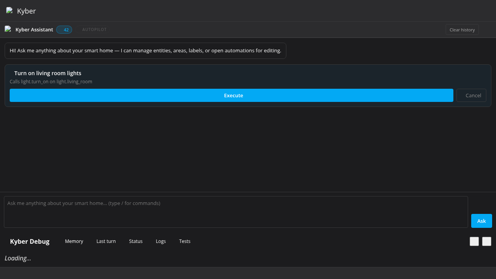
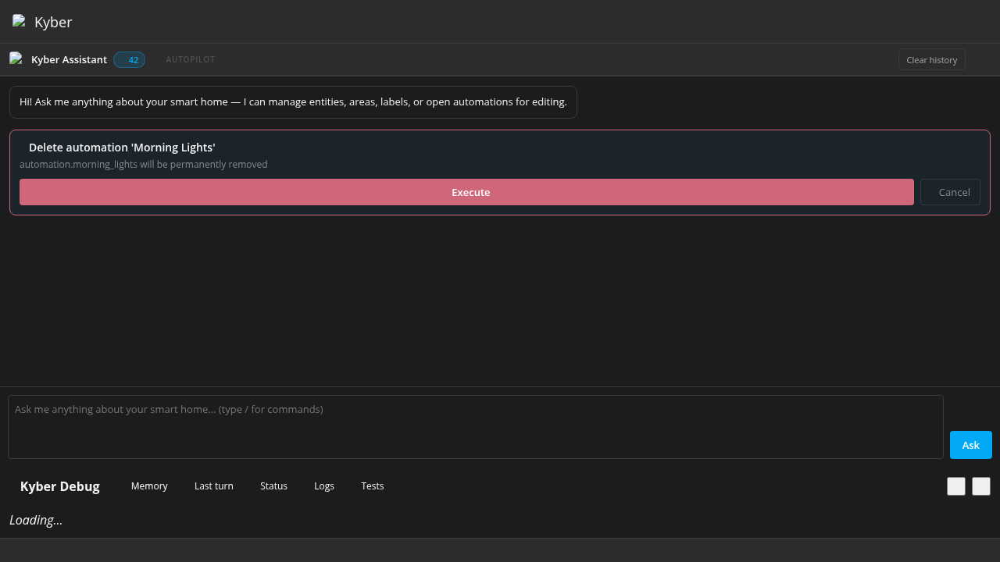

# Kyber Slash Commands

Slash commands let you control Home Assistant resources directly from the Kyber chat panel without leaving the interface. Type `/` in the chat input to see all command groups via autocomplete.

---

## Quick Reference

| Command | Description |
|---|---|
| `/autopilot on` | Enable autopilot mode |
| `/autopilot off` | Disable autopilot mode |
| `/dashboard open [name]` | Open YAML editor for a dashboard |
| `/dashboard close` | Close the dashboard editor |
| `/dashboard save` | Save the currently-open dashboard |
| `/dashboard new` | Create a new dashboard |
| `/dashboard delete` | Delete the currently-open dashboard |
| `/automation open <name>` | Open YAML editor for an automation |
| `/automation close` | Close the automation editor |
| `/automation save` | Save the currently-open automation |
| `/automation new` | Open HA's automation editor in a new tab |
| `/automation delete <name>` | Delete an automation |
| `/script open <name>` | Open YAML editor for a script |
| `/script close` | Close the script editor |
| `/script save` | Save the currently-open script |
| `/script new` | Open HA's script editor in a new tab |
| `/script delete <name>` | Delete a script |
| `/blueprint browse` | Open HA's Blueprint page in a new tab |
| `/area new <name>` | Create a new area |
| `/area delete <name>` | Delete an area |
| `/area rename <old> to <new>` | Rename an area |
| `/area list` | List all areas |
| `/session new [name]` | Create a new chat session |
| `/session list` | List all chat sessions |
| `/session switch <name>` | Switch to a different session |
| `/session delete` | Delete the current session |
| `/update` | Check for updates and install via HACS |
| `/update restart` | Install via HACS and restart Home Assistant |
| `/update force` | Bypass HACS — download directly from GitHub |
| `/update force restart` | Download from GitHub and restart HA |
| `/memory list` | List all saved memory entries |
| `/memory search <q>` | Search memory entries by keyword |
| `/memory add <text>` | Add a new fact directly from chat |
| `/memory analyze` | Analyze home config and propose memory entries |
| `/memory deep` | Start deep background analysis (6-lens rotation) |
| `/memory stats` | Show entry counts by category and source |
| `/memory delete <id>` | Delete a memory entry by id |
| `/reset` | Clear chat and start over |
| `/help [command]` | Show all commands or detailed help |

---

## System Commands

### `/update`

Checks whether a newer version of Kyber is available (via HACS) and installs it if so. Reports the version being downloaded inline in the chat.

- If Kyber is already up-to-date, shows a confirmation with an option to refresh HACS.
- Requires HACS to be installed and Kyber to be managed by HACS.

```
/update
/update restart
```

**`/update restart`** — same as `/update`, but also restarts Home Assistant automatically after installation.

### `/update force`

Bypasses HACS entirely. Fetches the latest release directly from GitHub (`api.github.com/repos/pgroene/kyber/releases/latest`), downloads the zipball, and extracts `custom_components/kyber/` and `www/kyber/` into your HA config directory.

Use this when HACS fails to detect a new version or when you want to update without HACS.

```
/update force
/update force restart
```

**Security:** the download URL is validated against `github.com`/`api.github.com` before fetching. File extraction uses a path-traversal guard. Requires HA authentication.

> **Note:** After a force-update, restart Home Assistant to load the new Python code.

---

### `/autopilot on` / `/autopilot off`

Toggles **Autopilot mode**. When autopilot is active, the ⚡ Autopilot ON badge appears in the header and Kyber will automatically execute generated action plans without additional confirmation prompts.

```
/autopilot on
/autopilot off
```

Commands that make changes show a **confirmation card** before executing. Destructive operations display a red danger variant:





---

## Dashboard Commands

### `/dashboard open [name]`

Opens the built-in YAML editor for a Lovelace dashboard. The `name` argument is matched against the dashboard's **title** and **url_path** (fuzzy). Omitting the name opens the default Overview dashboard.

**Match priority:**
1. Exact `url_path` match
2. Title contains the search string
3. `url_path` contains the search string

```
/dashboard open
/dashboard open home
/dashboard open energy
```

### `/dashboard close`

Closes the YAML editor immediately without saving.

```
/dashboard close
```

### `/dashboard save`

Shows a confirm card for the currently-open dashboard, then writes the YAML back to Home Assistant on confirmation. Requires a dashboard to be open; otherwise shows an error.

```
/dashboard save
```

### `/dashboard new`

Shows a confirm card, then prompts for a title and creates a new Lovelace dashboard.

```
/dashboard new
```

### `/dashboard delete`

Shows a **danger confirm card** for the currently-open dashboard. On confirmation, permanently removes the dashboard from the sidebar via `lovelace/dashboards/delete`. Cannot delete the default Overview dashboard.

> ⚠ This permanently removes the dashboard from the sidebar.

```
/dashboard delete
```

---

## Automation Commands

### `/automation open <name>`

Fuzzy-finds an automation by **entity ID** or **friendly name**, then shows a confirm card. On confirmation, loads the automation's YAML into the built-in editor.

**Match priority:**
1. Exact `automation.<name>` entity ID
2. Friendly name contains the search string
3. Entity ID contains the search string

```
/automation open morning lights
/automation open automation.notify_on_motion
/automation open notify
```

### `/automation close`

Closes the YAML editor without saving.

```
/automation close
```

### `/automation save`

Shows a confirm card for the currently-open automation, then calls the HA API to persist the YAML. Requires an automation editor to be open.

```
/automation save
```

### `/automation new`

Shows a confirm card, then opens HA's native automation editor (`/config/automation/edit/new`) in a new browser tab.

```
/automation new
```

### `/automation delete <name>`

Fuzzy-finds the automation by name, then shows a **danger confirm card**. On confirmation, permanently deletes the automation via `DELETE config/automation/config/<id>`.

> ⚠ This permanently deletes the automation.

```
/automation delete morning lights
/automation delete automation.old_routine
```

---

## Script Commands

Script commands mirror automation commands exactly, operating on `script.*` entities and the `config/script/config/` API path.

### `/script open <name>`

Fuzzy-finds a script by entity ID or friendly name and loads it into the YAML editor.

```
/script open good night
/script open script.run_vacuum
```

### `/script close`

Closes the editor without saving.

```
/script close
```

### `/script save`

Confirms, then saves the currently-open script.

```
/script save
```

### `/script new`

Opens HA's native script editor (`/config/script/edit/new`) in a new tab.

```
/script new
```

### `/script delete <name>`

Fuzzy-finds the script, shows a **danger confirm card**, then permanently deletes via `DELETE config/script/config/<id>`.

> ⚠ This permanently deletes the script.

```
/script delete good night
```

---

## Blueprint Commands

### `/blueprint browse` / `/blueprint open`

Shows a confirm card, then opens HA's Blueprint management page (`/config/blueprint`) in a new tab.

```
/blueprint browse
```

---

## Area Commands

### `/area new <name>`

Shows a confirm card, then creates a new area with the given name via the Kyber `/api/kyber/execute` endpoint.

```
/area new Living Room
/area new Garage
```

### `/area delete <name>`

Shows a **danger confirm card**, then deletes the area. The area ID is derived by lowercasing the name and replacing spaces with underscores.

> ⚠ Entities assigned to this area will become unassigned.

```
/area delete old office
```

### `/area rename <old> to <new>`

Shows a confirm card previewing `"<old>" → "<new>"`, then renames the area.

```
/area rename old office to home office
/area rename Garage to Double Garage
```

### `/area list`

Displays all areas in chat as a bulleted list with each area's name and ID. No confirm card — output appears immediately.

```
/area list
```

Example output:
```
Areas:
• Living Room (living_room)
• Kitchen (kitchen)
• Garage (garage)
```

---

## Chat Session Commands

Multiple independent conversations, each with its own history and AI context.

### `/session new [name]`

Creates a new chat session and switches to it. The optional name defaults to `Session <n>`.

```
/session new
/session new Evening Setup
```

### `/session list`

Displays all sessions with their message count and marks the active session.

```
/session list
```

Example output:
```
Chat Sessions:
1. Session 1 (12 messages) ← active
2. Evening Setup (3 messages)
```

### `/session switch <name>`

Switches to a different session. History is loaded from persistence.

```
/session switch Evening Setup
/session switch Session 1
```

### `/session delete`

Shows a **danger confirm card**, then deletes the current session and switches to the previous one. A new default session is created if this was the last one.

---

## Knowledge / Memory Commands

`/memory` is an alias of `/knowledge`.

### `/knowledge` (or `/memory`)

Lists current memory entries and opens the interactive memory card in chat.

```
/knowledge
/memory
```

### `/knowledge search <q>`

Filters memory entries by query text.

```
/knowledge search bedroom thermostat
```

### `/knowledge add <text>`

Adds a new fact directly to the knowledge store without going through AI analysis.

```
/memory add The living room thermostat is controlled by climate.living_room
/memory add Peter works from home on Tuesdays and Thursdays
```

### `/knowledge analyze`

Runs backend analysis of your automations/scripts and shows proposed memory facts from your current setup.

```
/knowledge analyze
```

### `/knowledge deep`

Starts a deep background analysis using 6 analytical lenses (daily routines, device inventory, occupancy patterns, time/location triggers, energy usage, safety rules). Runs asynchronously and reports progress in chat.

```
/memory deep
```

### `/knowledge stats`

Shows a summary of memory entries broken down by category and source.

```
/memory stats
```

### `/knowledge delete <id>`

Deletes the specified memory entry. Supports autocomplete — typing `/memory delete ` shows matching entry IDs and previews.

```
/knowledge delete abcd1234
```

---

## Help Commands

### `/help`

Displays a quick-reference table of all available slash commands in chat.

```
/help
```

### `/help <command>`

Shows detailed documentation for a specific command group.

```
/help autopilot
/help dashboard
/help session
/help reset
```

---

## Reset Command

### `/reset`

Shows a **danger confirm card**, then clears all messages in the current session (in-memory and persisted). Useful for starting a fresh conversation without switching sessions.

```
/reset
```

---

## The Confirm Card

Every command with side effects shows a **confirm card** in the chat history before taking action. This prevents accidental changes.

```
┌─────────────────────────────────────────┐
│  📊  Open dashboard editor              │
│      Home                               │
│                                         │
│  [ ▶ Execute ]   [ ✕ Cancel ]          │
└─────────────────────────────────────────┘
```

**Danger operations** (any `delete` command) render with red styling and an additional warning message:

```
┌─────────────────────────────────────────┐
│  🗑  Delete automation                  │
│      automation.morning_lights          │
│                                         │
│  ⚠ This permanently deletes the        │
│    automation.                          │
│                                         │
│  [ ▶ Execute ]   [ ✕ Cancel ]          │  ← red button
└─────────────────────────────────────────┘
```

- **Execute** — performs the action; button becomes disabled after click to prevent double-submission.
- **Cancel** — removes the card without performing any action.

---

## Autocomplete

Typing `/` in the chat input shows all top-level command groups:

```
autopilot on  autopilot off  dashboard  automation  script  blueprint  area  knowledge  memory  session  reset  help
```

Typing a partial command, such as `/automation open morn`, narrows suggestions to matching entity names so you can tab-complete or click to fill the full command.

> 💡 **Hint:** The chat input placeholder reminds you: *type / for commands*.
